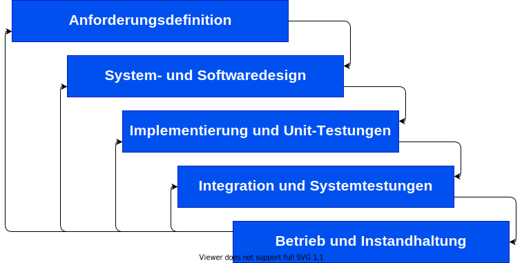

<!-- Das reserviert 30% der Folien-Breite für das Bild auf der rechten Seite. Das Bild an sich wird auf 80% Größe skaliert -->

# Software-Prozesse

## eine Präsentation von Gruppe 2

- Sonja Klein
- Gergana Germanova
- Daorsa Hasani

---

## Software-Prozesse allgemein

<!-- Das reserviert 40% der Folien-Breite für das Bild auf der linken Seite. Das Bild an sich wird auf 90% Größe skaliert -->

### **Definiton**: 
Der Software Prozess ist eine abstrakte Methode zur Entwicklung eines Softwaresystems. 

Er einen strukturierten Satz erforderlicher Aktivitäten

Software-Prozesse bestehen aus 5 Aktivitäten :

---

## Die Aktivitäten im Detail: 

### **Software Spezifikation**
definiert, was das System tun soll;
 - Requirements Engineering (Erhebung, Spezifikation und Verifizierung von Anforderungen)
  
### **Software Design und Implementierung** 
Definition der Organisation des Systems und Implementierung des Systems;
- Entwurf und Dokumentation der Softwarearchitektur
- User Interface Design (UI-Design)
- Softwareentwicklung (Implementierung)

---

## Die Aktivitäten im Detail: 

### **Software Validierung** 
  Überprüfung, ob es das tut, was der Kunde will;
  - Softwaretests (Qualitätssicherung, QS)
   
### **Software Betrieb**
- Softwarebereitstellung (Liefern des Softwareprodukts, Ausführen zur Ausführung bringen)
- Softwarebetrieb (Überwachung und Fehlerbehebung des Systems während der Ausführung)

### **Software Evaluation**
  Anpassungen an veränderte Kunden- und Marktanforderungen;
- Softwareentwicklung (Verfolgen und Priorisieren von Änderungsanfragen und neuen Funktionen) 

---

## Das Wasserfall-Modell

### **Definition**
* ist ein typisches plangesteuertes Modell
* alle verschiedenen Aktivitäten werden getrennt und nacheinander ausgeführt  

---

### Ähnliche Modelle
Es gibt auch andere auf dem Wasserfall-Modell basierende Modelle. 
* das `V-Modell` ähnelt dem Wasserfallmodell, legt aber den Schwerpunkt auf die Erstellung geeigneter Testspezifikationsdokumente für jede Phase.
* das `spiralförmige Modell` ähnelt dem Wasserfallmodell ebenfalls, bietet aber Zwischenprototypen zur Verifizierung - das "echte" Endprodukt, das mit der endgültigen Technologie entwickelt wird, ist jedoch erst ganz am Ende testbar

---

### Ein großer Nachteil 
* Das eigentliche Produkt (laufende Software) entsteht **erst nach langer Zeit** (manchmal nach mehreren Jahren)
* Zu diesem Zeitpunkt werden die ersten echten Benutzertests durchgeführt und können kritische Designfehler oder missverstandene Anforderungen aufdecken, Anforderungen können sich geändert haben, Technologien können veraltet sein. 
* *Aber das Wichtigste ist: Zu diesem Zeitpunkt erfordern alle Änderungen einen großen Aufwand!*

## Willst du mehr erfahren?
Dann schau doch einfach mal auf diese Seite! 
* [HTWG](https://de.wikipedia.org/wiki/Wasserfallmodell) 

---

## Inkrementelle Software-Entwicklung

### **Defintion**
*Die inkrementelle Entwicklung ist ein strategisches Vorgehensmodell innerhalb der agilen Software-Entwicklung. Dabei wird zunächst das Gesamtsystem geplant, das einem modularen Aufbau folgt. Die Realisierung des Projektes erfolgt anschließend in Einzelschritten.* 

---

### Vorteile
* die Kosten bei der Implementation von geänderten Anforderungen sind niederieger als beim Wasserfall-Modell 
* die Rücksprache mit den Kunden ist besser ausgestattet 
* schnellle Lieferung von beretigestelltes Software ist möglich 

### Nachteile
* keine Transperenz beim Prozesserstellen 
* schon implementierten Strukturen zerfallen nach dem Hinzufügen von neuen Elementen 