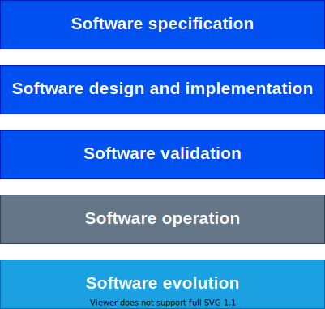

- [Der Software-Prozess](#der-software-prozess)
    - [**Definiton**:](#definiton)
- 
  - [Die Aktivitäten im Detail:](#die-aktivitäten-im-detail)
    - [**Software Spezifikation**](#software-spezifikation)
    - [**Software Design und Implementierung**](#software-design-und-implementierung)
    - [**Software Validierung**](#software-validierung)
    - [**Software Betrieb**](#software-betrieb)
    - [**Software Evaluation**](#software-evaluation)
- [Das Wasserfall-Modell](#das-wasserfall-modell)
  - [**Definition**](#definition)
  - [Ähnliche Modelle](#ähnliche-modelle)
  - [Ein großer Nachteil](#ein-großer-nachteil)
  - [Willst du mehr erfahren?](#willst-du-mehr-erfahren)
- [Inkrementelle Software-Entwicklung](#inkrementelle-software-entwicklung)
  - [**Defintion**](#defintion)
  - [Vorteile](#vorteile)
  - [Nachteile](#nachteile)

<!-- von Gergana Germanova, Daorsa Hasani und Sonja Klein -->

 

# Der Software-Prozess

### **Definiton**: 
Der Software Prozess ist eine abstrakte Methode zur Entwicklung eines Softwaresystems. 

Er einen strukturierten Satz erforderlicher Aktivitäten

Software-Prozesse bestehen aus 5 Aktivitäten :

# 
## Die Aktivitäten im Detail: 

### **Software Spezifikation**
definiert, was das System tun soll;
 - Requirements Engineering (Erhebung, Spezifikation und Verifizierung von Anforderungen)
  
### **Software Design und Implementierung** 
Definition der Organisation des Systems und Implementierung des Systems;
- Entwurf und Dokumentation der Softwarearchitektur
- User Interface Design (UI-Design)
- Softwareentwicklung (Implementierung)
  
### **Software Validierung** 
  Überprüfung, ob es das tut, was der Kunde will;
  - Softwaretests (Qualitätssicherung, QS)
   
### **Software Betrieb**
- Softwarebereitstellung (Liefern des Softwareprodukts, Ausführen zur Ausführung bringen)
- Softwarebetrieb (Überwachung und Fehlerbehebung des Systems während der Ausführung)

### **Software Evaluation**
  Anpassungen an veränderte Kunden- und Marktanforderungen;
- Softwareentwicklung (Verfolgen und Priorisieren von Änderungsanfragen und neuen Funktionen) 

<!-- ----------------------------------- -->

   

# Das Wasserfall-Modell

## **Definition**
* ist ein typisches plangesteuertes Modell
* alle verschiedenen Aktivitäten werden getrennt und nacheinander ausgeführt  

## Ähnliche Modelle
Es gibt auch andere auf dem Wasserfall-Modell basierende Modelle. 
* das `V-Modell` ähnelt dem Wasserfallmodell, legt aber den Schwerpunkt auf die Erstellung geeigneter Testspezifikationsdokumente für jede Phase.
* das `spiralförmige Modell` ähnelt dem Wasserfallmodell ebenfalls, bietet aber Zwischenprototypen zur Verifizierung - das "echte" Endprodukt, das mit der endgültigen Technologie entwickelt wird, ist jedoch erst ganz am Ende testbar

## Ein großer Nachteil 
* Das eigentliche Produkt (laufende Software) entsteht **erst nach langer Zeit** (manchmal nach mehreren Jahren)
* Zu diesem Zeitpunkt werden die ersten echten Benutzertests durchgeführt und können kritische Designfehler oder missverstandene Anforderungen aufdecken, Anforderungen können sich geändert haben, Technologien können veraltet sein. 
* *Aber das Wichtigste ist: Zu diesem Zeitpunkt erfordern alle Änderungen einen großen Aufwand!*

## Willst du mehr erfahren?
Dann schau doch einfach mal auf diese Seite! 
* [HTWG](https://de.wikipedia.org/wiki/Wasserfallmodell) 

<!-- ----------------------------------- -->

   

# Inkrementelle Software-Entwicklung

## **Defintion**
*Die inkrementelle Entwicklung ist ein strategisches Vorgehensmodell innerhalb der agilen Software-Entwicklung. Dabei wird zunächst das Gesamtsystem geplant, das einem modularen Aufbau folgt. Die Realisierung des Projektes erfolgt anschließend in Einzelschritten.*    

  

## Vorteile

* die Kosten bei der Implementation von geänderten Anforderungen sind niederieger als beim Wasserfall-Modell 

* die Rücksprache mit den Kunden ist besser ausgestattet 

* schnellle Lieferung von beretigestelltes Software ist möglich 

## Nachteile

* keine Transperenz beim Prozesserstellen 
  
* schon implementierten Strukturen zerfallen nach dem Hinzufügen von neuen Elementen 

