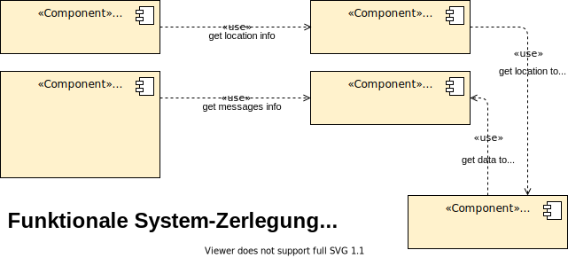

# Übung 4, Funktionale Zerlegung

Team 2: Daorsa Hasani, Gergana Germanova, Sonja Klein 

---

## System-Kontext-Abgrenzung

Design-Decisions: 
- Unsere Polizeiberichte werden in Word verfasst. Wir haben nachgefragt und festgestellt, dass es dafür noch kein System gibt.  
- Alternativ hätte man die Polizeiberichterstellung auch in unser System integrieren können, da dies aber nicht unseren Anforderungen entspricht haben wir uns gegen diesen Mehraufwand entschieden. 

---

## Funktionale Zerlegung (zur Laufzeit)

Design-Decisions: 
- Wir haben das Display-Data-Design ausgewählt um Unabhängigkeit und Sicherheit zu gewährleisten. Ein System wie unseres muss zu jeder Zeit den geltenden Gesetzten und Richtlinien entsprechen und deshalb flexibel anpassbar sein. Je leichter einzelne Komponenten unabhängig von einander anpassbar bzw austauschbar sind, desto besser. 

---

## Daten (zur Laufzeit)

Design-Decisions: 
- Die Message ist mit dem User unser wichtigstes Datenobjekt. 
- In einer Message kann, muss aber nicht ein Location-Datenobjekt gespeichert werden. 
- Möchte ein User seine Daten exportieren, dann wird dies in einem weiteren Datenobjekt festgehalten. 
- Das Passwort eines Users muss verschlüsselt gespeichert werden um Sicherheit zu gewährleisten. 