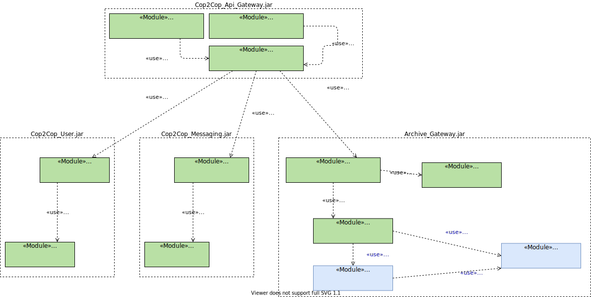
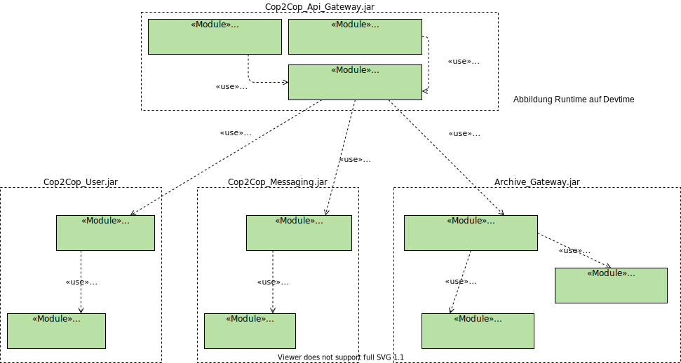

# Übung 5, Architektur-Dokumentation <!-- omit in toc -->

Team 2: Daorsa Hasani, Gergana Germanova, Sonja Klein

- [1. Einleitung](#1-einleitung)
  - [1.1. Geschäftskontext](#11-geschäftskontext)
  - [1.2. Systemübersicht](#12-systemübersicht)
  - [1.3. Randbedingungen (Constraints)](#13-randbedingungen-constraints)
  - [1.4. Stakeholder](#14-stakeholder)
  - [1.5. Ziele des Dokuments](#15-ziele-des-dokuments)
- [2. Systemkontext und Domäne](#2-systemkontext-und-domäne)
  - [2.1. System-Kontext-Abgrenzung](#21-system-kontext-abgrenzung)
  - [2.2. Domänenmodell](#22-domänenmodell)
- [3. Architekturtreiber (Funktion und Qualität)](#3-architekturtreiber-funktion-und-qualität)
  - [3.1. Wesentliche funktionale Anforderungen](#31-wesentliche-funktionale-anforderungen)
  - [3.1.1 Bilder auf Twitter posten](#311-bilder-auf-twitter-posten)
  - [3.1.2 Niemand Unberechtigtes hat Zugriff auch Nachrichten](#312-niemand-unberechtigtes-hat-zugriff-auch-nachrichten)
  - [3.2. Qualitätsattribute](#32-qualitätsattribute)
  - [3.2.1 zuverlässige Zustellung von Text-Nachrichten innerhalb von 2ms (Performanz - 1)](#321-zuverlässige-zustellung-von-text-nachrichten-innerhalb-von-2ms-performanz---1)
  - [3.2.2 zuverlässige Zustellung von Mediendateien innerhalb von 1m (Performanz - 2)](#322-zuverlässige-zustellung-von-mediendateien-innerhalb-von-1m-performanz---2)
  - [3.2.3 zuverlässige Zustellung eines Standortes innerhalb von 1m (Zuverlässigkeit - 3)](#323-zuverlässige-zustellung-eines-standortes-innerhalb-von-1m-zuverlässigkeit---3)
  - [3.2.4 zuverlässige Wegbeschreibung zu einem empfangenem Standort ohne Fehlleitung (Zuverlässigkeit - 4)](#324-zuverlässige-wegbeschreibung-zu-einem-empfangenem-standort-ohne-fehlleitung-zuverlässigkeit---4)
  - [3.2.5 effizienteste Wegbeschreibung zu einem empfangenem Standort (Effizienz - 5)](#325-effizienteste-wegbeschreibung-zu-einem-empfangenem-standort-effizienz---5)
  - [3.2.6 zuverlässige Zustellung von Standort innerhalb von 1m (Zuverlässigkeit - 6)](#326-zuverlässige-zustellung-von-standort-innerhalb-von-1m-zuverlässigkeit---6)
  - [3.2.7 Anzeigen von Online-Offline Informationen innerhalb von 1sek (Performanz - 7)](#327-anzeigen-von-online-offline-informationen-innerhalb-von-1sek-performanz---7)
  - [3.2.8 Medien und Nachrichten werden innerhalb von 1sek exportiert (Performanz - 8)](#328-medien-und-nachrichten-werden-innerhalb-von-1sek-exportiert-performanz---8)
  - [3.2.9 generierte Informationen werden automatisch archiviert (Datensicherheit - 9)](#329-generierte-informationen-werden-automatisch-archiviert-datensicherheit---9)
  - [3.2.10 Archivierte Informationen werden nach 2 Jahren automatisch gelöscht (Datensicherheit - 10)](#3210-archivierte-informationen-werden-nach-2-jahren-automatisch-gelöscht-datensicherheit---10)
  - [3.2.11 Mediendateien werden innerhalb von 20 sek auf Twitter gepostet (Performanz - 11)](#3211-mediendateien-werden-innerhalb-von-20-sek-auf-twitter-gepostet-performanz---11)
  - [3.2.12 Archivierte Informationen werden vor fremden Dritten geschützt gespeichert (Sicherheit - 12)](#3212-archivierte-informationen-werden-vor-fremden-dritten-geschützt-gespeichert-sicherheit---12)
  - [3.2.13 Eine Gruppe wird erstellt und alle eingeladenen User werden innerhalb 1sek benachrichtigt (Performanz - 13)](#3213-eine-gruppe-wird-erstellt-und-alle-eingeladenen-user-werden-innerhalb-1sek-benachrichtigt-performanz---13)
  - [3.2.14 Eine Gruppe wird erstellt und alle eingeladenen User können die Inhalte des Chats innerhalb 1sek sehen (Zuverlässigkeit - 14)](#3214-eine-gruppe-wird-erstellt-und-alle-eingeladenen-user-können-die-inhalte-des-chats-innerhalb-1sek-sehen-zuverlässigkeit---14)
  - [3.2.15 zuverlässige Zustellung von Audios innerhalb von 2ms (Performanz - 1)](#3215-zuverlässige-zustellung-von-audios-innerhalb-von-2ms-performanz---1)
- [4. Systemdekomposition](#4-systemdekomposition)
  - [4.1. Lösungsansatz und zentrale Architekturentscheidungen](#41-lösungsansatz-und-zentrale-architekturentscheidungen)
  - [4.2. Systemdomänen](#42-systemdomänen)
  - [4.3. Systemstruktur](#43-systemstruktur)
  - [4.4. Datenmodell](#44-datenmodell)
  - [4.5. Code-Organisation (Abbildung Laufzeit auf Entwicklungszeit)](#45-code-organisation-abbildung-laufzeit-auf-entwicklungszeit)
  - [4.6. Build-Prozess und -Struktur](#46-build-prozess-und--struktur)
  - [4.7. Deployment und Betrieb](#47-deployment-und-betrieb)
  - [4.8. Technologien](#48-technologien)
- [5. Architekturkonzepte](#5-architekturkonzepte)
  - [5.1. Konzept #1](#51-konzept-1)
    - [5.1.1. Architektur-Treiber](#511-architektur-treiber)
    - [5.1.2. Lösungsidee](#512-lösungsidee)
    - [5.1.3. Design-Entscheidungen](#513-design-entscheidungen)
    - [5.1.4. Verworfene Alternativen](#514-verworfene-alternativen)
  - [5.2. Konzept #2](#52-konzept-2)
    - [5.2.1. Architektur-Treiber](#521-architektur-treiber)
    - [5.2.2. Lösungsidee](#522-lösungsidee)
    - [5.2.3. Design-Entscheidungen](#523-design-entscheidungen)
    - [5.2.4. Verworfene Alternativen](#524-verworfene-alternativen)
- [6. Risiken und technische Schulden](#6-risiken-und-technische-schulden)
- [7. Ausblick und Pläne für die Zukunft](#7-ausblick-und-pläne-für-die-zukunft)
- [8. Glossar](#8-glossar)
- [Umsetzung von Qualitätsattributen](#umsetzung-von-qualitätsattributen)
- [Deployment](#deployment)
- [Funktionale Zerlegung (zur Laufzeit)](#funktionale-zerlegung-zur-laufzeit)
- [Funktionale Zerlegung (zur Laufzeit)](#funktionale-zerlegung-zur-laufzeit-1)
- [Wireframes: Figma](#wireframes-figma)
    - [User Story 2, *Nachrichten erhalten/versenden*](#user-story-2-nachrichten-erhaltenversenden)
- [Akzeptanzkriterien:](#akzeptanzkriterien)
- [Nicht-fuktionalen Anforderungen:](#nicht-fuktionalen-anforderungen)
  - [**Benutzeranforderungen: Nachrichten**](#benutzeranforderungen-nachrichten)
    - [User Story 1, *Push Nachrichtenmeldungen*](#user-story-1-push-nachrichtenmeldungen)
    - [User Story 2, *Nachrichten erhalten/versenden*](#user-story-2-nachrichten-erhaltenversenden-1)
    - [User Story 3, *Audio-Nachrichten*](#user-story-3-audio-nachrichten)
    - [User Story 4, *Videos und Fotos versenden*](#user-story-4-videos-und-fotos-versenden)
    - [User Story 5, *Online/Offline Bezeichnung*](#user-story-5-onlineoffline-bezeichnung)
    - [User Story 6, *Standort-Sharing*](#user-story-6-standort-sharing)
    - [User Story 7, *Posts auf Twitter erstellen*](#user-story-7-posts-auf-twitter-erstellen)
    - [User Story 8, *Chat Nachrichten/Photos exportieren*](#user-story-8-chat-nachrichtenphotos-exportieren)
    - [User Story 9, *automatische Archivierung*](#user-story-9-automatische-archivierung)
    - [User Story 10, *archivierte Nachrichten nach zwei Jahren löschen*](#user-story-10-archivierte-nachrichten-nach-zwei-jahren-löschen)
    - [User Story 11, *Gruppenerstellung*](#user-story-11-gruppenerstellung)
    - [User Story 12, *Rollen*](#user-story-12-rollen)
    - [User Story 13, *Gruppeneinteilung*](#user-story-13-gruppeneinteilung)
    - [User Story 14, *Web-Erweiterung*](#user-story-14-web-erweiterung)
    - [User Story 15, *Sicherheit*](#user-story-15-sicherheit)
- [Systemanforderungen](#systemanforderungen)

## 1. Einleitung

In der Einleitung schaffen wir ein grundlegendes Verständnis über das System Cop2Cop. Wir beschreiben den Geschäftskontext mit dem System zugrunde liegenden Geschäftszielen, geben eine Übersicht auf oberster Ebene über das System, nennen zu berücksichtigende Randbedingungen und relevante Stakeholder. Darüber hinaus erläutern wir die Ziele dieses Dokuments.

### 1.1. Geschäftskontext

Durch die Entwicklung der Chat-Applikation Cop2Cop soll eine Möglichkeit für Streifenbedienstete und Leitstellenpersonal geschaffen werden, miteinander in Verbindung zu stehen. (Motivation und Kerntreiber  <!-- noch mehr schreiben -->)

Bei der Entwicklung des Systems müssen rechtliche Rahmenedingungen (Gesetze und Richtlinien für den öffentlichen Dienst) eingehalten werden. Vor allem im Bereich Datensicherheit muss dabei sehr genau gearbeitet werden. 
<!--besondere Herausforderungen-->

Durch das System wird eine effiziente Kommunikation zwischen Bediensteten erreicht. Außerdem wird die Berichterstellung automatisert. Zusätzlich ist ein genauer und automatisierter Austausch von Wegbeschreibungen möglich. Es ist wichtig dass dabei die Sicherheit vor unbefugten Dritten gewährleistet ist. Die Webanwendung sollte unseren Qualitätsanforderungen soweit entsprechen, dass der Export der App ins Ausland eine sinnvolle Folgerung ist.
<!-- Geschäftsziele-->

<!-- In welchen geschäftlichen oder Projekt-Kontext ist das System eingebettet? -->

<!-- Welche Aufgabenstellung ergibt sich dadurch für das System? -->

### 1.2. Systemübersicht

Cop2Cop ist eine Webanwendung die es Streifenbediensteten und Leitstellenpersonal möglich macht miteinander in Verbindung zu stehen. 
Mit Cop2Cop kann ein Bediensteter 
- mit dem Hany gemachte Fotos und Videos teilen, 
- zu Adressen Wegbeschreibungen aufrufen, 
- selektierte Fotos und Chat-Nachrichten in den Polizeibericht übernehmen, 
- einzelne Bilder zusammen mit Kurznachricht von der Leitstelle oder Pressestelle
auf Twitter posten, 
- alle Daten werden nur in kontrollierten Geräten/Servern in Deutschland gespeichert, 
- die Nachrichten werden verlässlich zugestellt
- alles Material (Bilder, Videos, Chats) wird zwei Jahre lang archiviert und danach
gelöscht
Es ist außerdem möglich das System mit CopPlanner zu verbinden, einem Schichtplanungssystem, worüber nach Verbindungserstellung automatisiert Gruppen mit allen zur Schicht eingeteilten Streifenbediensteten in Cop2Cop angelegt werden.

***Endbenutzertypen***
- Streifenbedienstete 
- Leitstellenpersonal
- Pressestelle der Polizei

<!--
Wir beschreiben hier Merkmale, die man auch auf einem (fiktiven) Produktkarton für diese Software aufdrucken würde.
- Was sind die wirklich wichtigen Qualitätseigenschaften des Systems?
- Was macht das System brauchbar?
-->

### 1.3. Randbedingungen (Constraints)

***Entwicklungsteam*** 
- Projektmanager + Projektmanager (teilzeit aus der IT Abteilung der Polizei)
- SCRUM-TEAM
  - Scrum-Master
  - Produkt-Owner 
  - Developers
    - Back-End x 2
    - Front-End x 2
    - Full-Stack x 1
    - DevOps x 1(macht einer der Entwickler zusätzlich)
    - QA x 1
- 2,5 Leute zur Verfügung als Puffer

Wir haben uns entschieden das System neu zu entwickeln. Wir haben spezifische Anforderungen und die Komplexität des Systems durch eventuelle Sicherheitsanforderungen ist uns noch nicht bekannt. Daher finden wir die Scrum-Vorgehnsweise am passenden. 

Die Überlegung ein System einzukaufen wurde verworfen, da unsere systemspezifischen Anforderungen(Sicherheit, ...) nicht getroffen werden könnten. Ein großer möglicher Zeitaufwand könnte außerderm auf uns zukommen, wenn wir unsere spezifischen Anforderungen in ein bestehendes System einbauen wollen. 

Bei der Entwicklung des Systems müssen rechtliche Rahmenedingungen (Gesetze und Richtlinien für den öffentlichen Dienst) eingehalten werden. Vor allem im Bereich Datensicherheit muss dabei sehr genau gearbeitet werden.
<!--
- Was sind wichtige Randbedingungen und Vorgaben, die nicht verändert, aber bei der Entwicklung berücksichtigt werden müssen? Zum Beispiel:
  - Randbedingungen aus der Domäne ("Um als Medizinprodukt zu gelten, muss das System X, Y, Z erfüllen")
  - Organisatorische Randbedingungen wie Prozesse, Teamstruktur/-größe, Sicherheitsrichtlinien, Open- oder Closed-Source-Strategien
  - Technische Randbedingungen ("Das System muss die vorhandene Oracle-Datenbank benutzen")
  - Rechtliche Randbedingungen ("Das System muss DSGVO-konform sein")
  - Kosten und Zeit ("Das System muss bis zum 2.2.2022 mit einem Budget von 222.222 € durchgeführt werden")
- Welche Auswirkungen auf Entwicklung, Qualitätssicherung und Betrieb kann man aus den Randbedingungen direkt ableiten?
- Gelten die Einschränkungen für das System, eine Produktfamilie, oder die ganze Firma?
-->

### 1.4. Stakeholder

Ein Stakeholder ist eine Person oder Organisation, die (direkt oder indirekt) Einfluss auf die Anforderungen eines Systems hat oder die von dem System betroffen ist.

In unserem Projekt kommen dabei als erste Gruppe die Bediensteten aller deutschlandweiten Polizeireviere in den Sinn. Die zukünftigen Nutzer des Systems sind 
- Streifenbedienstete, 
- Leitstellenpersonal und 
- die Pressestelle der Polizei. 
Da nach Erfolg des Projektes die Polizeireviere im EU-Ausland mitintegriert werden sollen, ist es wichtig auch im Vorhinein diese Stakeholdergruppe zu beachten. 

Die IT-Abteilung der Polizei hat ebenfalls Interesse an der Mitgestaltung des Systems, denn es wird in ihre IT-Landschaft integriert.

Die Entwickler im Projektteam bilden ebenfalls eine relevante Stakeholdergruppe. 

Aber nicht nur interne, auch externe Stakeholder sind zu beachten. Da es sich um ein System für eine staatliche Einrichtung handelt, ist die Bevölkerung ebenfalls eine Stakeholdergruppe. Auch sie könnten zusätzlichen Input für unser Projekt liefern. Da das System mit der Pressestelle zusammen agieren soll, ist auch diese vom Projekt betroffen.

Und auch das Innenminesterium für Staatssicherheit muss in das Projekt als Stakeholder integriert werden. 

<!-- Was sind die jeweiligen Tätigkeiten und Verantwortlichkeiten der jeweiligen Stakeholder? -->
<!-- Was sind ihre jeweiligen Anliegen? Das heißt, was ist ihnen im System wichtig und was ist ihre jeweilige Erwartungshaltung? -->

### 1.5. Ziele des Dokuments

Diese Dokumentation ist eine Entwurf und beschreibt ein System, was sich noch in Planung befindet. Nach der erstmaligen Fertigstellung der Dokumentation ist es jedoch essentiell dass sie kontinuierlich ergänzt und an den Stand des Systems angepasst wird.

Das Verfassen dieses Dokument hilft aber nicht nur nach der Fertigstellung allen Projektbeteiligten weiter, es zwingt auch dazu das System und alle Überlegungen zu Anforderungen, Kontext, ... noch einmal gesammelt zu betrachten und zu durchdenken. 

<!-- Für welche Stakeholder enthält das Dokument relevante Informationen und wo sind diese jeweils zu finden? -->

## 2. Systemkontext und Domäne

Wir beschreiben in diesem Kapitel, in welchem Kontext das System eingesetzt wird.

### 2.1. System-Kontext-Abgrenzung

- Unsere Polizeiberichte werden in Word verfasst. Wir haben nachgefragt und festgestellt, dass es dafür noch kein System gibt.  
- Alternativ hätte man die Polizeiberichterstellung auch in unser System integrieren können, da dies aber nicht unseren Anforderungen entspricht haben wir uns gegen diesen Mehraufwand entschieden. 

<!-- Beschreiben und nochmal durchsehen -->
<!--
- Wie ist das System in seinen Kontext eingebettet?
- Von welchen Rollen wird das System aus welchem Grund verwendet?
- Welche Nutzerschnittstellen bietet das System?
- Mit welchen externen Systemen interagiert das System?
- (Wie ist das System in seine Systemlandschaft integriert?)
- Auf welche Weise interagiert das System mit externen Systemen und welche Daten werden ausgetauscht?
-->

### 2.2. Domänenmodell

<!--
- Welche Entitäten (Kernelemente aus der geschäftlichen Domäne) gibt es, die im System eine Bedeutung haben und davon verarbeitet werden müssen?
- Wie ist die jeweilige Bedeutung der unterschiedlichen Entitäten?
- Wie hängen die Entitäten miteinander zusammen?
- (Lassen sich Unterdomänen bilden, in denen die Entitäten jeweils eine unterschiedliche Bedeutung haben?)
-->

## 3. Architekturtreiber (Funktion und Qualität)

In den folgenden Kapiteln wird ein Überblick über die wichtigsten Anforderungen für das System gegeben, welche die Ausgestaltung der Architektur beeinflussen. Diese Anforderungen, genannt Architekturtreiber, umfassen  funktionale Anforderungen und Qualitätsanforderungen (in diesem Kapitel beschrieben) sowie Geschäftsziele und Randbedingungen (bereits in Kapitel 1 beschrieben).

### 3.1. Wesentliche funktionale Anforderungen

Was sind die wichtigsten funktionalen Anforderungen an das System? Was muss das System können?  Ohne welche Funktionen wäre das System wertlos?

<!-- müssen wir da jetzt noch mehr schreiben??? -->

### 3.1.1 Bilder auf Twitter posten
- Als *Mitarbeitender in der Polizeistelle*, möchte ich *einzelne Bilder auf Twittter posten können*, damit *ich der Öffentlichkeit effizienter Informationen bereitstellen kann*
- Als *Bediensteter*, möchte ich *selektierte Photos und Nachrichten exportieren können*, damit *ich sie leicht in Polizeiberichte importieren kann*.
- Als *Bediensteter*, möchte ich *dass nach zwei Jahren alle archivierte Daten gelöscht werden*, damit *ich keine unnötige Daten auf mein Messenger haben*.

### 3.1.2 Niemand Unberechtigtes hat Zugriff auch Nachrichten
- Als *Bediensteter*, möchte ich *dass niemand Unberechtigtes meine Nachrichten sehen kann*, damit *ich Informationen austauschen kann und trotzdem meine gesetzlichen Anforderungen einhalte*.
- Als *Bedienstete*, möchte ich *die Möglichkeit haben Nachrichten zu verschicken und zu bekommen*, damit *ich mit anderen kommunizieren kann*.

### 3.2. Qualitätsattribute

Was sind die Qualitätsanforderungen an das System, die einen treibenden Einfluss auf die Gestaltung der Architektur haben? Über welche Szenarios kann man überprüfen, ob das System die Qualitätsanforderungen erfüllt?

<!-- NOCH ÜBERALL ERGÄNZEN:
- Priorität: Hoch (Hoch, Mittel, Niedrig)
- Status: Offen (Offen, Bereit, Umgesetzt) -->

### 3.2.1 zuverlässige Zustellung von Text-Nachrichten innerhalb von 2ms (Performanz - 1)
- Priorität: Hoch (Hoch, Mittel, Niedrig)
- Status: Offen (Offen, Bereit, Umgesetzt)
- Umgebung:App wird benutzt von verschiedenen Usern, welche Nachrichten austauschen 
  - Useranzahl > 1000
- Stimulus: User 1 sendet eine Nachricht an User 2 
  - gesendete Nachricht < 5Kb
- Antwort: User 2 erhält die Nachricht auf dem Chatbereich innerhalb t
  - t <= 2ms

### 3.2.2 zuverlässige Zustellung von Mediendateien innerhalb von 1m (Performanz - 2)
- Priorität: Hoch (Hoch, Mittel, Niedrig)
- Status: Offen (Offen, Bereit, Umgesetzt)
- Umgebung:App wird benutzt von verschiedenen Usern, welche Nachrichten austauschen 
  - Useranzahl > 1000
- Stimulus: User 1 sendet eine Mediendatei (Photo, Video, Sprachnachricht) an User 2 
  - gesendete Nachricht < 3Mb
- Antwort: User 2 erhält die Mediendatei auf dem Chatbereich innerhalb t
  - t <= 1 m

### 3.2.3 zuverlässige Zustellung eines Standortes innerhalb von 1m (Zuverlässigkeit - 3)
- Priorität: Hoch (Hoch, Mittel, Niedrig)
- Status: Offen (Offen, Bereit, Umgesetzt)
- Umgebung:User 1 befindet sich in einem ländlichen Gebiet. Die verfügbare Bandbreitenverbindung ist auf UMTS-HSPA beschränkt.
  - Netzwerkgeschwindigkeit < 7,2 Mbit/s
- Stimulus: User 1 sendet Standort an User 2 
  - gesendete Standortnachricht < 3Mb
- Antwort: User 2 erhält den Standort auf dem Chatbereich innerhalb t
  - t <= 1 m

### 3.2.4 zuverlässige Wegbeschreibung zu einem empfangenem Standort ohne Fehlleitung (Zuverlässigkeit - 4)
- Priorität: Hoch (Hoch, Mittel, Niedrig)
- Status: Offen (Offen, Bereit, Umgesetzt)
- Umgebung:User 1 befindet sich in einem ländlichen Gebiet. Die verfügbare Bandbreitenverbindung ist auf UMTS-HSPA beschränkt.
  - Netzwerkgeschwindigkeit < 7,2 Mbit/s
- Stimulus: User 1 möchte zu einem empfangenen Standort geleitet werden
  - empfangener Standort hat eine Genauigkeit von einem Radius < 30m 
- Antwort: User 2 erhält die Wegbeschreibung in einem seperaten Fenster der Applikation
  - jede Wegbeschreibung führt zum Ziel (empfangener Standort) 

### 3.2.5 effizienteste Wegbeschreibung zu einem empfangenem Standort (Effizienz - 5)
- Priorität: Hoch (Hoch, Mittel, Niedrig)
- Status: Offen (Offen, Bereit, Umgesetzt)
- Umgebung:User 1 befindet sich in einem ländlichen Gebiet. Die verfügbare Bandbreitenverbindung ist auf UMTS-HSPA beschränkt.
  - Netzwerkgeschwindigkeit < 7,2 Mbit/s
- Stimulus: User 1 möchte zu einem empfangenen Standort geleitet werden
  - Netzwerkgeschwindigkeit < 7,2 Mbit/s
- Antwort: User 2 erhält die kürzester Weg-Wegbeschreibung in einem seperaten Fenster der Applikation
  - es wird immer die im-Moment-kürzester-Weg-Wegbeschreibung von allen Alternativen angezeigt

### 3.2.6 zuverlässige Zustellung von Standort innerhalb von 1m (Zuverlässigkeit - 6)
- Priorität: Hoch (Hoch, Mittel, Niedrig)
- Status: Offen (Offen, Bereit, Umgesetzt)
- Umgebung:User 1 befindet sich in einem ländlichen Gebie. Die verfügbare Bandbreitenverbindung ist auf UMTS-HSPA beschränkt.
  - Netzwerkgeschwindigkeit < 7,2 Mbit/s
- Stimulus: User 1 sendet eine MedienDatei(Photo, Video, Sprachnachricht) an User 2 
  - gesendete Nachricht < 3Mb
- Antwort: User 2 erhält die Nachricht auf dem Chatbereich innerhalb t
  - t <= 1 m

### 3.2.7 Anzeigen von Online-Offline Informationen innerhalb von 1sek (Performanz - 7)
- Priorität: Hoch (Hoch, Mittel, Niedrig)
- Status: Offen (Offen, Bereit, Umgesetzt)
- Umgebung: User 1 hat die Applikation mit dem Chatbereich des Users 2 geöffnet
  - Useranzahl > 1000
- Stimulus: User 2 öffnet die Applikation und wechselt somit von 'Offline' zu 'Online'. 
  - Netzwerkgeschwindigkeit < 7,2 Mbit/s
- Antwort: User 1 sieht den Aktuellen Zustand innerhalb t
  - t <= 1sek

### 3.2.8 Medien und Nachrichten werden innerhalb von 1sek exportiert (Performanz - 8)
- Priorität: Hoch (Hoch, Mittel, Niedrig)
- Status: Offen (Offen, Bereit, Umgesetzt)
- Umgebung: User 1 hat die Applikation mit dem Chatbereich des Users 2 und einer darin enthaltenen Mediendatei geöffnet
  - Useranzahl > 1000
- Stimulus: User 1 möchte diese Mediendatei exportieren um sie in einen Polizeibericht hinzuzufügen
  - gesendete Mediendatei < 3Mb
- Antwort: User 1 erhält die exportierte Datei innerhalb t
  - t <= 1sek

### 3.2.9 generierte Informationen werden automatisch archiviert (Datensicherheit - 9)
- Priorität: Hoch (Hoch, Mittel, Niedrig)
- Status: Offen (Offen, Bereit, Umgesetzt)
- Umgebung: User 1 hat die Applikation und den Chatbereich mit User 2 geöffnet 
  - Useranzahl > 1000 
- Stimulus: User 1 sendet eine Nachricht an User 2
  - gesendete Nachricht < 5kb
- Antwort: Die neu generierten Informationen werden in einem Archiv gespeichert innerhalb t
  - t <= 1min

### 3.2.10 Archivierte Informationen werden nach 2 Jahren automatisch gelöscht (Datensicherheit - 10)
- Priorität: Hoch (Hoch, Mittel, Niedrig)
- Status: Offen (Offen, Bereit, Umgesetzt)
- Umgebung: Die Daten von User 1 sind archiviert
  - Archivgröße > 20 GB 
- Stimulus: Daten des User 1 werden älter als 2 Jahre
  - Nachricht > 2 Jahre
- Antwort: Die Daten des User 1, die die 2 Jahre Grenze überschritten haben, werden innerhalb t gelöscht
  - t <= 1min

### 3.2.11 Mediendateien werden innerhalb von 20 sek auf Twitter gepostet (Performanz - 11)
- Priorität: Hoch (Hoch, Mittel, Niedrig)
- Status: Offen (Offen, Bereit, Umgesetzt)
- Umgebung: User 1 hat den Chatbereich mit User 2 und eine darin enthaltene Mediendatei geöffnet 
  - Netzwerkgeschwindigkeit < 7,2 Mbit/s, Useranzahl > 1000
- Stimulus: User 1 möchte diese Mediendatei auf Twitter teilen
  - gesendete Mediennachricht < 3Mb
- Antwort: Die Mediendatei wird innerhalb t auf Twitter veröffentlicht
  - t <= 20 sek

### 3.2.12 Archivierte Informationen werden vor fremden Dritten geschützt gespeichert (Sicherheit - 12)
- Priorität: Hoch (Hoch, Mittel, Niedrig)
- Status: Offen (Offen, Bereit, Umgesetzt)
- Umgebung: Die Daten von User 1 sind archiviert
  - Archivgröße > 20 GB 
- Stimulus: Eine fremde dritte Person möchte die Daten von User 1 einsehen 
  - Eine Brute-Force Attack wird auf das Archiv ausgeübt
- Antwort: Die Daten des User 1 sind verschlüsselt und passwortgeschützt gespeichert, sodass ein fremder Dritter keinen Zugriff hat. Außerdem werden aktuelle Sicherheitsstandards eingehalten. 
  - Alle empfohlenen Sicherheitsstandards des BSI sind eingehalten

### 3.2.13 Eine Gruppe wird erstellt und alle eingeladenen User werden innerhalb 1sek benachrichtigt (Performanz - 13)
- Priorität: Hoch (Hoch, Mittel, Niedrig)
- Status: Offen (Offen, Bereit, Umgesetzt)
- Umgebung: User 1 hat den Chatbereich der Applikation offen
  - Netzwerkgeschwindigkeit < 7,2 Mbit/s, Useranzahl > 1000
- Stimulus: User 1 erstellt eine neue Gruppe mit den Teilnehmern User 1, User 2 und User 3 
  - Gruppengröße > 2 User
- Antwort: User 2 und User 3 werden innerhalb t benachrichtigt, dass sie nun Teil der neu erstellten Gruppe sind
  - t <= 1 sek

### 3.2.14 Eine Gruppe wird erstellt und alle eingeladenen User können die Inhalte des Chats innerhalb 1sek sehen (Zuverlässigkeit - 14)
- Priorität: Hoch (Hoch, Mittel, Niedrig)
- Status: Offen (Offen, Bereit, Umgesetzt)
- Umgebung: User 1 und User 2 ist Teil der Gruppe A und hat den Chatbereich dieser Gruppe geöffnet
  - Netzwerkgeschwindigkeit < 7,2 Mbit/s, Useranzahl der Gruppe > 1000
- Stimulus: User 1 sendet eine Nachricht in die Gruppe A
  - gesendete Nachricht < 2kb
- Antwort: User 2 erhält die Nachricht innerhalb t ohne Verlust
  - t <= 1 sek

### 3.2.15 zuverlässige Zustellung von Audios innerhalb von 2ms (Performanz - 1)
- Priorität: Hoch (Hoch, Mittel, Niedrig)
- Status: Offen (Offen, Bereit, Umgesetzt)
- Umgebung: App wird benutzt von verschiedenen Usern, welche Nachrichten austauschen 
  - Useranzahl > 1000
- Stimulus: User 1 sendet eine Audiodatei an User 2 
  - gesendete Nachricht < 5Kb
- Antwort: User 2 erhält die Audiodatei auf dem Chatbereich innerhalb t
  - t <= 2ms

## 4. Systemdekomposition

In den Unterabschnitten dieses Kapitels beschreiben wir, wie die grundlegende Lösungsstrategie für das System ist, welche wichtigen Entscheidungen für das System getroffen wurden und warum und wie das System nach Funktionalität, Daten und Deployment gegliedert ist.

### 4.1. Lösungsansatz und zentrale Architekturentscheidungen

<!-- Was ist der grundsätzliche Lösungsansatz für das System? -->
<!-- Welche grundlegenden Architekturentscheidungen wurden getroffen? -->

Programmiersprachen und Technologien:
- Framework: SpringBoot benutzen wir für das ganze Backend, Java
- Maven für den Build
- Jenkins fürs Testen und Integrieren
- Frontend: Vue.js  und Vuetify.js

***Designprinzipien***
- Trennung der Zuständigkeiten: Durch die Microservices-Architektur 
- Kapselung: Durch die Microservices
- Divide and Conquer: Durch die Microservices

***Architektur-Trends***
- Microservices: siehe Designprinzipien
- Wir werden mit einem DevOps Team arbeiten. → Es gibt nur ein Team, dh. das eine Team hat volle Zuständigkeit

<!-- ich glaube die kommen hier eigentlich auch nicht hin?? Aber wo dann? -->

### 4.2. Systemdomänen

<!-- Wie lässt sich das System nach unterschiedlichen Domänen zergliedern (im Sinne von Domain-Driven Design) -->
<!-- Wie hängen die Domänen miteinander zusammen? -->
<!-- Welche Abhängigkeiten und Synchronisierungsbedarfe gibt es? -->

### 4.3. Systemstruktur

<!-- Wie sieht die funktionale Dekomposition des Systems zur Laufzeit im Sinne von Komponenten aus? -->
<!-- Welche Aufgaben haben die einzelnen Komponenten? -->
<!-- Wie interagieren diese miteinander? -->
<!-- Welche Daten werden zwischen den Komponenten ausgetauscht? -->

### 4.4. Datenmodell

***Daten (zur Laufzeit)***

 
- Die Message ist mit dem User unser wichtigstes Datenobjekt. 
- In einer Message kann, muss aber nicht ein Location-Datenobjekt gespeichert werden. 
- Möchte ein User seine Daten exportieren, dann wird dies in einem weiteren Datenobjekt festgehalten. 
- Das Passwort eines Users muss verschlüsselt gespeichert werden um Sicherheit zu gewährleisten. 

<!-- Wie sieht das grundlegende Datenmodell für das System aus? -->
<!-- Was sind die fachlichen Entitäten und welche Beziehungen existieren zwischen diesen? -->

### 4.5. Code-Organisation (Abbildung Laufzeit auf Entwicklungszeit)

Es gibt für jeden Microservice ein eigenes Repository. Wir verwalten unsere Projekte in Git. 
- für Frontend
  - Projekt für Frontend OS
  - Projekt für Frontend WebApp
- für Backend
  - Projekt für Gateway
  - Projekt für User
  - Projekt für Messaging
  - Projekt für Archive

- Eine Komponente entspricht in der Regel einem Modul. 
- Eine Ausnahme bildet hierbei aber die Gateway-Komponente. Diese enthält die Module Authentifizierung und Routing.

Alle Module werden in der gleichen Struktur organisiert. Da wir die Microservices-Architektur gewählt haben, verlieren die Projekte nicht an Übersicht, wenn wir nach Rest, Services, DAOs strukturieren. 
- src
  - main
    - java
      - rest
        - controller
      - services
        - service
        - mapper
      - DAO
        - repository
- ...
  
<!--
- Wie werden Komponenten (Laufzeit) auf Module (Entwicklungszeit) abgebildet (Runtime-to-devtime mapping)?
- Durch welche Code-Strukturen (z.B. Java-Klassen) werden die Module realisiert?
- Wie ist der Quellcode in Paketen organisiert?
- Welche Versionskontrolle wird eingesetzt? Welche Repositories gibt es für welchen Quellcode und welche Konfiguration?
 -->

### 4.6. Build-Prozess und -Struktur

- die Mobile App Datei und die Web App Datei realisieren das Frontend 
- die Cop2Cop_Gateway.jar realisiert ein Gateway mit welchem die Frontends kommunizieren
- die Microservices Jars realisieren einmal eine Userverwaltung, einmal eine Messagingverwaltung und einmal das Archiv. 

Ausführungsumgebungen gibt es nur den Webbrowser und das Mobilgerät. Das Mobilgerät haben wir nur als OS weil wir die Beamten nur Apple Geräte nutzen werden um maximale Sicherheit zu gewährleisten und wir deshalb kein Android usw. anbieten müssen. 

Wir haben uns für die MicroServices Architektur entschieden, um unser System leicht austauschbar zu gestalten. 

Deployment-Artefakte werden die dargestellten Jar Dateien der MicroServices zu Ausführung gebracht (die Mobile App Datei in der VM und die Cop2Cop Web App für den Browser).

Jede Ausführungsumgebung gibt es nur einmal. Externe Systeme gibt es einige: sehr viele Clients, es gibt einmal Twitter, einmal Word, einmal Maps.

- Die Frontends nutzen Twitter um zu posten
- Die Frontends nutzen Maps um Directions/Location zu bekommen 
- Das Gateway spricht Word an, genau dann, wenn eines der Microservice Word nutzen möchte. 

Wir haben 3 Datenbanken (Archiv, User, Messages).

<!-- ich glaube die Infos kommen gar nicht alle hier rein, aber wo sonst? :D -->
<!--
- Welche Deployment-Artefakte gibt es?
- Wie werden Module in Deployment-Artefakte verpackt?
- Wie werden die Deployment-Artefakte erstellt?
- Welche Stages gibt es? -->

### 4.7. Deployment und Betrieb

<!--
- Wie sieht die Ausführungsumgebung des Systems aus?
- Wie wird das System zwischen Client und Backend aufgeteilt? Welche unterschiedlichen Nodes oder Ausführungsumgebungen gibt es für Client und Backend?
- Wie werden die Deployment-Artefakte auf die Ausführungsumgebung(en) gebracht?
- Welche Werkzeuge werden dafür verwendet?
- Wird das System bei einem Cloud-Provider betrieben?
- Wird eine Platform as a Service verwendet? -->

### 4.8. Technologien

<!--- Was sind die wichtigsten verwendeten Technologien für die Ausführung Entwicklung des Systems?
- Welche Entscheidungen haben dazu geführt, das sie verwendet werden?
- Welche Frameworks und wiederverwendbare Bibliotheken werden eingesetzt? Warum? -->

## 5. Architekturkonzepte

<!--In diesem Kapitel beschreiben wir, wie Sie die von den Architekturtreibern geforderten Funktions- und Qualitätsziele erreichen.-->

### 5.1. Konzept #1

<!--Wir benutzten als Überschrift den konkreten Namen des Lösungskonzepts, z.B. "Mandantenkonzept", "Skalierbarkeit", "Logging", "Testbarkeit", "Internationalisierung", "Monitoring", "Konfiguration", "Offline-Fähigkeit und Datensynchronisation".  -->

#### 5.1.1. Architektur-Treiber

<!-- Welche Treiber werden von diesem Konzept angesprochen/umgesetzt?  -->

<!-- Es genügt, wenn wir Referenzen auf die Treiber einfügen (z.B. die Scenario-ID).  -->

#### 5.1.2. Lösungsidee

<!-- Welche Idee verfolgen wir mit diesem Konzept?  -->

<!-- Wir illustrieren die Idee mit Architektur-Sichten und entsprechendem Begleittext.  -->

#### 5.1.3. Design-Entscheidungen
  
<!-- Welche grundsätzlichen Design-Entscheidungen haben wir für dieses Lösungskonzept getroffen? Z.B. Architekturstil(e), Technologien, Frameworks, Strategien  -->

#### 5.1.4. Verworfene Alternativen

<!-- Welche alternative(n) Lösung(en) haben wir diskutiert und verworfen?  -->
<!-- Warum wurden sie verworfen? -->

### 5.2. Konzept #2

<!-- Nach demselben Schema wie bei Konzept #1 beschreiben wir hier weitere Lösungskonzepte. -->

#### 5.2.1. Architektur-Treiber

#### 5.2.2. Lösungsidee

#### 5.2.3. Design-Entscheidungen

#### 5.2.4. Verworfene Alternativen

## 6. Risiken und technische Schulden

Potenzielle Risiken können vor allem in Form von Sicherheitsaspekten ins Spiel kommen. Bei
Anwendung, die von der Polizei genutzt wird, entstehen täglich neue sensible Daten, die für Angreifer von hohem Interesse sein können und die von hohem Interesse für Angreifer sein können und die Anwendung zu einer Zielscheibe machen. 

Um Sicherheitsrisiken zu minimieren, ist es zum Beispiel notwendig, die Schnittstellen innerhalb des Systems und zu externen Verbindungen so gut wie möglich zu nutzen und zu überwachen und während der täglichen Nutzung zu überwachen. 

Es gibt aber auch grundsätzliche Risiken, wie z.B. eine die Unterschätzung der Komplexität des Projekts oder eine unbekannte Anforderungen die durch eine unzureichende Anforderungsanalyse nicht aufgedeckt wurden. Spätere Überarbeitungen können je nach Projektstand teure Maßnahmen mit sich bringen.

<!-- Governicus ?? -->

Technische Schulen könnten in Zukunft noch entstehen, da wir aber noch nicht mit der Implementierung angefangen haben gibt es dazu noch nichts zu dokumentieren.<!-- Welche Entscheidungen der Vergangenheit haben sich als unpassend herausgestellt und sollten revidiert werden? --> <!-- Welche Technologien sind mittlerweile veraltet? -->

<!-- Welche Design-Entscheidungen sind am riskantesten, etwa weil sie auf Annahmen basieren, die wir nicht genau überprüft haben oder überprüfen konnten? Oder weil sie unbekannte Lösungskonzepte oder Technologien einsetzen? -->

## 7. Ausblick und Pläne für die Zukunft

<!-- Cop2Cop fürs EU-Ausland + nicht nur OS sondern auch Android 

 ( + Berichterstellung im System automatisieren? -> nicht nur mit Word sondern mit einem anderen Programm oder in unseres integrieren ) -->

<!-- Welche Verbesserungsmöglichkeiten gibt es? -->
<!-- Welche Weiterentwicklungen sind geplant? -->

## 8. Glossar

Hier definieren wir Begriffe, die der Zielgruppe beim Lesen des Dokuments unklar sein könnten.

<!-- _Begriff_: Definition -->

<!-- Figma? , Funktionale Zerlegung (?!), ...-->

_CQRS_: Command-Query-Responsibility-Segregation ist ein Vorgehensmuster, welches unterschiedliche Datenmodelle und Schnittstellen für schreibende und lesenden Datenzugriffe verwendet. Weitere Informationen findet man in [Martin Fowlers Blogeintrag zu dem Thema (englisch)](https://martinfowler.com/bliki/CQRS.html).

------------------------------------------

Noch irgendwo unterbringen: 
Aufgabe 5: Deployment, DevTime, Qualittsattribute, Trends_Präsi.md

## Umsetzung von Qualitätsattributen
- Archivierte Informationen werden nach 2 Jahren automatisch gelöscht (Datensicherheit - 10) 
- Archivierte Informationen werden vor fremden Dritten geschützt gespeichert (Sicherheit - 12) 

## Deployment

---------------------------------------------
Noch irgendwo unterbringen: 
Aufgabe 4: Funktionale Zerlegung_präsi.md

## Funktionale Zerlegung (zur Laufzeit)

## Funktionale Zerlegung (zur Laufzeit)

Design-Decisions: 
- Wir haben das Display-Data-Design ausgewählt um Unabhängigkeit und Sicherheit zu gewährleisten. Ein System wie unseres muss zu jeder Zeit den geltenden Gesetzten und Richtlinien entsprechen und deshalb flexibel anpassbar sein. Je leichter einzelne Komponenten unabhängig von einander anpassbar bzw austauschbar sind, desto besser. 

---------------------------------------------
Noch irgendwo unterbringen: 
Aufgabe 3 + Aufgabe 2: Treiber_präsi.md
 
## Wireframes: Figma

https://www.figma.com/file/DgyKwBguhKAP7Pa8NMEmHo/Cop-2-Cop-Nachricht-schreiben?node-id=0%3A1 

Test Prototype: https://www.figma.com/proto/DgyKwBguhKAP7Pa8NMEmHo/Cop-2-Cop-Nachricht-schreiben?node-id=2%3A291&scaling=scale-down&page-id=0%3A1&starting-point-node-id=2%3A291 

#### User Story 2, *Nachrichten erhalten/versenden*

Als *Bedienstete*, möchte ich *die Möglichkeit haben Nachrichten zu verschicken und zu bekommen*, damit *ich mit anderen kommunizieren kann*.

## Akzeptanzkriterien:
- Man kann die Tastatur schließen, indem man irgendwo auf dem Chat klickt 
- Man kann von einem spezifischen Chat immer  mit dem Pfeil oben rechts zurück zu der Chat Übersicht 
- Wenn man das Nachrichtenfenster anklickt wird aus dem Sprachnachrichtenbutton ein Sende-Button
- Wenn man das Nachrichtenfenster anklickt wird die Tastatur geöffnet 
- Wenn ich auf einen Buchstaben von der Tastatur klicke erscheint er mir im Schreibfenster
- Wenn ich den Senden Button klicke:
  - Nachricht verschwindet von Schreibfenster
  - Nachricht erscheint im Chatverlauf
  - Nachricht wird versandt
  
## Nicht-fuktionalen Anforderungen:

- Eine unerfahrene Nutzer*in soll innerhalb von 4 Klicks eine Nachricht versenden können 
- Eine erfahrene Nutzer*in soll innerhalb von 1 min eine Standort verschickenn können 
- Eine erfahrene Nutzer*in soll bei geöffnete App max 7 Klicks brauchen um sein Profilbild zu ändern
- Eine unerfahrene Nutzer*in soll innerhalb von 1 min eine ungelesen Nachricht öffnen 

---------------------------------------------
Noch irgendwo unterbringen: 
Aufgabe 1

### **Benutzeranforderungen: Nachrichten**

#### User Story 1, *Push Nachrichtenmeldungen*

Als *Bedienstete*, möchte ich *über neue Nachrichten informiert werden*, damit *ich zeitnah auf dieser reagieren kann*.

#### User Story 2, *Nachrichten erhalten/versenden*

Als *Bedienstete*, möchte ich *die Möglichkeit haben Nachrichten zu verschicken und zu bekommen*, damit *ich mit anderen kommunizieren kann*.

#### User Story 3, *Audio-Nachrichten*

Als *Bediensteter*, möchte ich *durch Audios Informationen mit anderen Bediensteten austauschen können*, damit *der Informationsaustausch noch einfacher gelingt*.

#### User Story 4, *Videos und Fotos versenden*

Als *Bedienstete*, möchte ich *die Möglichkeit haben Videos und Bilder zu verschicken und zu bekommen*, damit *ich mehr als nur durch Text kommunizieren kann*.

#### User Story 5, *Online/Offline Bezeichnung*

Als *User*, möchte ich *sehen können, wer online ist*, damit *ich eine Übersicht habe wen ich schnell erreichen kann*.

#### User Story 6, *Standort-Sharing*

Als *Bediensteter*, möchte ich *Standort sowie deren Wegbeschreibungen teilen und einsehen*, damit *ich schnell an Orte kommen kann oder ich schnell erreicht werde*.

#### User Story 7, *Posts auf Twitter erstellen*

Als *Mitarbeitender in der Polizeistelle*, möchte ich *einzelne Bilder auf Twittter posten können*, damit *ich der Öffentlichkeit effizienter Informationen bereitstellen kann*.

#### User Story 8, *Chat Nachrichten/Photos exportieren*

Als *Bediensteter*, möchte ich *selektierte Photos und Nachrichten exportieren können*, damit *ich sie leicht in Polizeiberichte importieren kann*.

#### User Story 9, *automatische Archivierung*

Als *Bediensteter*, möchte ich *alle meine Daten zwei Jahren lang in einer Archive gespeichert haben*, damit *ich auf eventuelle wichtige Informationen zugreifen kann*.

#### User Story 10, *archivierte Nachrichten nach zwei Jahren löschen*

Als *Bediensteter*, möchte ich *dass nach zwei Jahren alle archivierte Daten gelöscht werden*, damit *ich keine unnötige Daten auf mein Messenger haben*.

#### User Story 11, *Gruppenerstellung*

Als *Bedienstete*, möchte ich *Gruppen erstellen oder beitreten können*, damit *ich mit meinem Team Informaitonen leicht teilen kann*.

#### User Story 12, *Rollen*

Als *Nutzer*, möchte ich *sehen können welche Rollen meine Kommunikationspartner besitzen*, damit *ich angemessen mit diesen umgehen kann*.

#### User Story 13, *Gruppeneinteilung*

Als *Leitender*, möchte ich *Teams/Gruppen erstellen können*, damit *Nachrichten gesammelt eine Personengruppe erreichen können*.

#### User Story 14, *Web-Erweiterung*

Als *Bediensteter*, möchte ich *auf alle (oder nur die wichtigsten) Funktionen auch in einem Webbrowser zugreifen können*, damit *diese Funktionen auch ohne mobildes Endgerät zur Verfügung stehen*.

#### User Story 15, *Sicherheit*

Als *Bediensteter*, möchte ich *dass niemand Unberechtigtes meine Nachrichten sehen kann*, damit *ich Informationen austauschen kann und trotzdem meine gesetzlichen Anforderungen einhalte*.

---
## Systemanforderungen
Push Nachrichtenmeldungen (User Story 1)

> ### Anforderung 1.1, *Push-Nachrichten aktiviert*
> **Given:** Ein anderer User2 (Bediensteter) hat eine Nachricht an den User1 gesendet  
> **When:** User 1 hat Push-Nachrichten erlaubt  
> **Then:** User 1 soll Push-Nachricht auf seinem Smartphone erhalten

> ### Anforderung 1.2, *Push-Nachrichten deaktiviert*
> **Given:** Ein anderer User2 (Bediensteter) hat eine Nachricht an den User1 gesendet  
> **When:** User 1 hat Push-Nachrichten nicht erlaubt  
> **Then:**  User 1 soll keine Push-Nachricht auf seinem Smartphone erhalten

---
Nachrichten versenden/erhalten  (User Story 2)

> ### Anforderung 2.1, *Nachrichten-Button*
> **Given:** die App ist geöffnet  
> **When:** User 1 möchte eine neue Nachricht versenden  
> **Then:** User 1 kann auf einen Button klicken um eine neue Nachricht zu verfassen

> ### Anforderung 2.2, *Nachrichten-Keyboard*
> **Given:** die Neue-Nachricht-Verfassen-Bereich ist geöffnet  
> **When:** User 1 möchte einen Text verfassen  
> **Then:** Ein Keyboard öffnet sich durch welches man einen dann angezeigten text verfassen kann

> ### Anforderung 2.3, *Nachrichten-Status gesendet*
> **Given:** User1 hat eine Nachricht gesendet und hat den Chat geöffnet  
> **When:** Nachricht wurde erflogreich gesendet  
> **Then:**  User 1 soll ein Hacken sehen 

> ### Anforderung 2.4, *Nachrichten-Status erhalten*
> **Given:** User1 hat eine Nachricht gesendet und hat den Chat geöffnet  
> **When:** Nachricht wurde bei User 2 erfolgreich erhalten  
> **Then:**  User 1 soll zwei Hacken sehen 

> ### Anforderung 2.5, *Nachrichten-Status gelesen*
> **Given:** User1 hat eine Nachricht gesendet und hat den Chat geöffnet  
> **When:** Nachricht wurde von User 2 geslesen 
> **Then:**  User 1 soll zwei farbige Hacken sehen 
